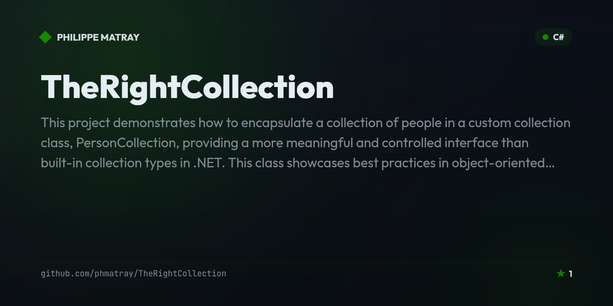

# The Right Collection

<!-- portfolio-badges:start -->
<!-- Identity -->
[](https://github.com/phmatray/TheRightCollection)

[](https://github.com/phmatray/TheRightCollection/stargazers)
[](https://github.com/phmatray/TheRightCollection/network/members)
[](https://github.com/phmatray/TheRightCollection/blob/HEAD/LICENSE)

<!-- Activity -->
[](https://github.com/phmatray/TheRightCollection/issues)
[](https://github.com/phmatray/TheRightCollection/pulls)
[](https://github.com/phmatray/TheRightCollection/commits)
<!-- portfolio-badges:end -->

<!-- portfolio-toc:start -->

## Table of Contents

- [Overview](#overview)
- [Features](#features)
- [Usage](#usage)
- [Running the Application](#running-the-application)
- [Roadmap](#roadmap)
- [Contributions](#contributions)
- [Tech Stack](#tech-stack)
- [License](#license)

<!-- portfolio-toc:end -->

<!-- portfolio-getstarted:start -->

## Getting Started

### Prerequisites

- [.NET SDK](https://dotnet.microsoft.com/download)

### Run

```bash
git clone https://github.com/phmatray/TheRightCollection.git
cd TheRightCollection
dotnet restore
dotnet build
dotnet run --project TheRightCollection.ConsoleApp/TheRightCollection.ConsoleApp.csproj
```

<!-- portfolio-getstarted:end -->


## Overview
This project demonstrates how to encapsulate a collection of people in a custom collection class, `PersonCollection`, providing a more meaningful and controlled interface than built-in collection types in .NET. This class showcases best practices in object-oriented design, including encapsulation, event handling, and the use of LINQ for data manipulation.

## Features

- **Custom Collection**: `PersonCollection` is a custom class that encapsulates a list of `Person` objects and exposes a set of methods for interacting with the data more effectively.
- **Indexers**: Provides two indexers, one for accessing `Person` objects by their index and another by their name.
- **Advanced Query Capabilities**: Includes methods for sorting, filtering, and finding specific people based on attributes like name and age.
- **Event Handling**: Implements events to notify other parts of the application when a person is added or removed.
- **Statistics Methods**: Functions to retrieve statistical information such as the average age, the oldest person, and the youngest person from the collection.

## Usage

### Creating and Managing People

You can create a new instance of `PersonCollection` and add `Person` objects to it. Each person is represented with a name and an age. Here's how to add people to the collection:

```csharp
PersonCollection people = new PersonCollection();
people.Add(new Person("Alice", 40));
people.Add(new Person("Bob", 35));
people.Add(new Person("Charlie", 50));
```

### Querying the Collection

The collection can be queried in various ways, such as finding people by name, sorting by age, or getting statistical data:

```csharp
var bobs = people.FindByName("Bob");
people.SortByAge();
var oldest = people.OldestPerson();
var youngest = people.YoungestPerson();
```

### Event Subscriptions

You can subscribe to `PersonAdded` and `PersonRemoved` events to get notified when changes occur in the collection:

```csharp
people.PersonAdded += (sender, e) => Console.WriteLine($"Person added: {e.Person.Name}");
people.PersonRemoved += (sender, e) => Console.WriteLine($"Person removed: {e.Person.Name}");
```

## Running the Application

To run this application, compile the code using Visual Studio or the .NET CLI, and execute the built executable. The program will demonstrate the capabilities of the `PersonCollection` class through various operations displayed in the console output.

## Roadmap

- [ ] Add a unit test project (xUnit) covering `PersonCollection`'s sorting, filtering, and event behavior
- [ ] Generalize `PersonCollection` into a reusable generic `EntityCollection<T>` pattern
- [ ] Add more query/statistics helpers (e.g. median age, group-by-age-range)
- [ ] Add JSON import/export for `PersonCollection` contents
- [ ] Package the collection as a standalone NuGet library separate from the console demo

See the [open issues](https://github.com/phmatray/TheRightCollection/issues) for more.

## Contributions

Contributions are welcome. Please feel free to fork the repository, make changes, and submit a pull request. For major changes, please open an issue first to discuss what you would like to change.

<!-- portfolio-techstack:start -->

## Tech Stack

- **.NET 10**

<!-- portfolio-techstack:end -->

## License

This project is licensed under the MIT License - see the LICENSE file for details.

<!-- portfolio-nugetkeep:start -->
---
Built by [Atypical Consulting](https://www.atypical.consulting). We also make
[NuGetKeep](https://nugetkeep.com/?utm_source=github-readme&utm_medium=readme&utm_campaign=launch-2026-07),
a self-hosted NuGet server with supply-chain quarantine.
<!-- portfolio-nugetkeep:end -->
